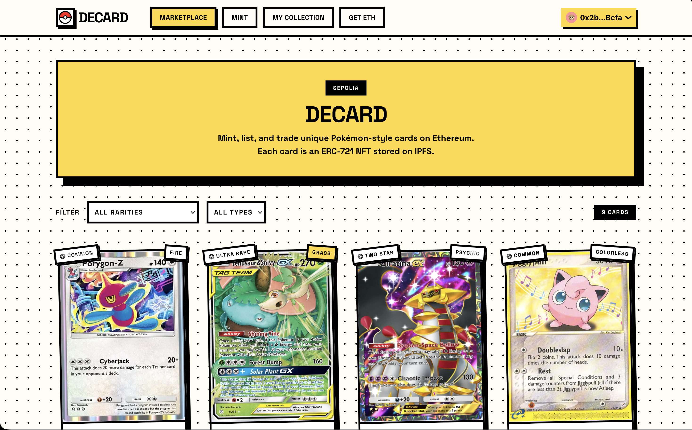

# Decard — Decentralized Pokemon Card  Marketplace

A decentralized marketplace where users can **mint, list, and buy** unique digital game cards on the **Ethereum Sepolia testnet**.

Each card is a unique **ERC-721** NFT with an image, name, description, and stats (rarity/type/attack/defense/HP). Images and metadata are stored on **IPFS** via **Pinata**.

## Project Overview & Features

- **Mint Custom Cards**: Search for Pokemon cards, customize stats (rarity, type, attack, defense, HP), and mint as NFTs
- **Marketplace**: List cards for sale and browse cards available for purchase
- **IPFS Storage**: All card metadata and images stored on IPFS.
- **Wallet Integration**: Full MetaMask/WalletConnect support with wagmi v2


## Tech Stack

### Smart Contracts
- **Solidity** `0.8.24`
- **OpenZeppelin** 4.9.6
- **Ape Framework** (Python) 

### Frontend
- **Next.js** 14
- **wagmi v2** + **viem** for Ethereum integration
- **RainbowKit** for wallet connections
- **Tailwind CSS** for styling

### IPFS
- **Pinata** for IPFS pinning and gateway hosting
- Public gateway: `https://gateway.pinata.cloud/ipfs/`
- Automatic fallback to other gateways on failure

## Getting Started

### Prerequisites

- Python >= 3.10 (managed with `uv`)
- Node.js >= 18 + npm

### Smart Contracts (Ape)

```bash
uv venv .venv
source .venv/bin/activate
uv sync
ape compile          # compile contracts
ape test             # run the test-suite (local EVM)
```

### Deploy to Sepolia (self host in some other testnet)

```bash
ape accounts generate decard
# fund the account from a Sepolia faucet, then:
ape run deploy --network ethereum:sepolia
```

### Frontend

```bash
cd frontend
npm install
cp .env.local.example .env.local   # add your Pinata JWT(1GB max storage) + deployed addresses
npm run dev
```

Open http://localhost:3000 and connect a wallet (e.g., MetaMask) on Sepolia.
Get the address of your account and press get eth in the website to open a faucet to get some Sepolia Eth for buying cards from the marketplace.

## Testnet & Contract Addresses

**Network**: Sepolia Testnet

| Contract | Address |
|----------|---------|
| GameCardNFT | `NEXT_PUBLIC_GAME_CARD_ADDRESS` in `.env.local` |
| Marketplace | `NEXT_PUBLIC_MARKETPLACE_ADDRESS` in `.env.local` |


## IPFS Implementation

### How It Works

1. **Image Upload**: When minting a card, the image is fetched, validated, and uploaded to Pinata
2. **Metadata Generation**: Card metadata (name, description, attributes) is bundled with the IPFS image URI
3. **JSON Upload**: The complete metadata is uploaded as JSON to Pinata
4. **URI Return**: Pinata returns an `ipfs://` URI that points to the metadata

### Files Structure

```
frontend/
├── src/
│   ├── app/api/pinata/route.ts      # Server-side upload endpoint
│   ├── lib/pinata.ts                 # Pinata API client
│   ├── lib/config.ts                 # IPFS gateway configuration
│   └── hooks/useIPFS.ts             
```


## Screenshots



## License

Uses GPLV3